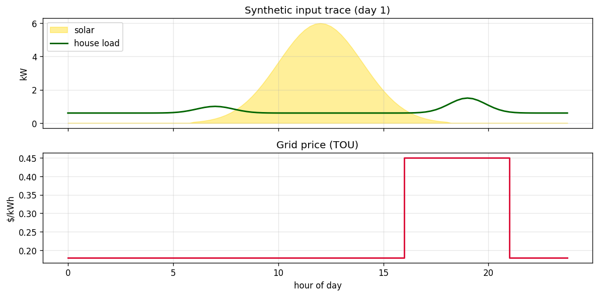
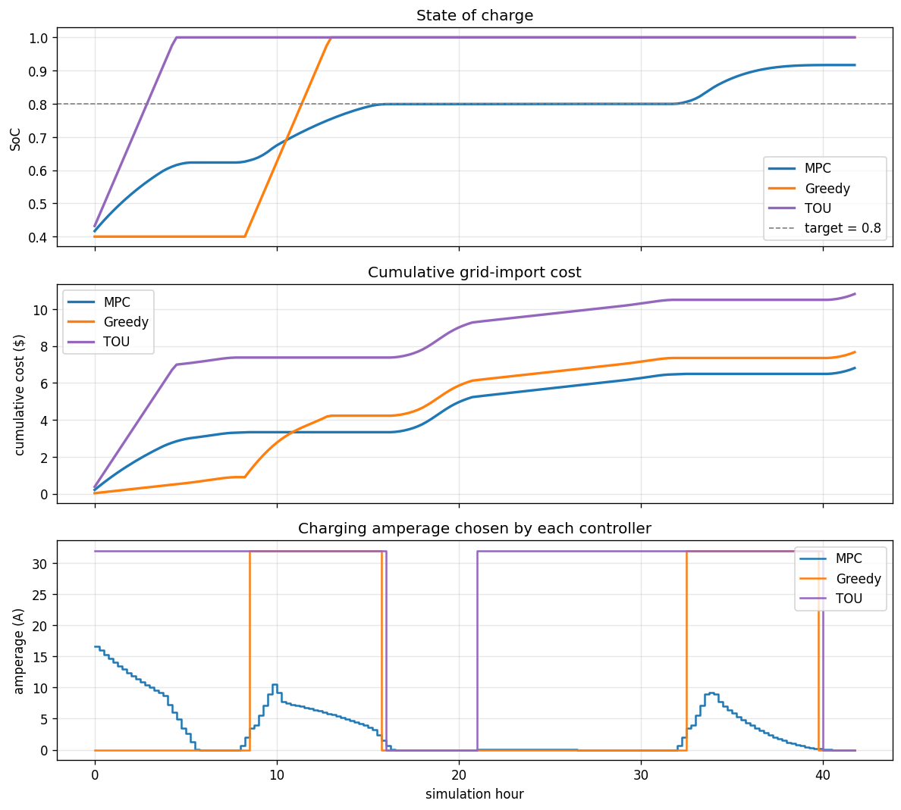

# 01 · Walkthrough

A one-trace, three-controller comparison. Regenerate the figures with:

```bash
uv run python scripts/plot_walkthrough.py
```

## The setup

Synthetic 2-day trace, 15-minute steps:
- **Solar:** Gaussian bell, 6 kW peak at noon, zero outside 6am–6pm
- **Load:** 0.6 kW base + small morning bump (~1 kW at 7am) + evening cooking spike (~1.5 kW at 7pm)
- **Price:** TOU schedule — $0.45/kWh peak (4pm–9pm), $0.18/kWh off-peak

EV: 60 kWh battery, starting at 40 % SoC, target 80 % by horizon end.
Charger: 240 V, 32 A max, 8 A/step slew limit.



## The three controllers

| Controller | Strategy                                              | Look-ahead |
|------------|-------------------------------------------------------|------------|
| **MPC**    | Receding-horizon optimization in cvxpy (CLARABEL)     | 6 hours    |
| **Greedy** | Charge at max when solar excess > 0.5 kW             | none       |
| **TOU**    | Charge at max when current price ≤ $0.25 / kWh        | none       |

Both baselines see only the current step. The MPC sees a 6-hour horizon.

## What the comparison shows



**MPC** (blue, top panel) climbs to ~62 % by hour 4 using cheap off-peak
power, parks there until midday, then ramps charging into the noon solar
peak (visible as the second amperage bump in the bottom panel — peaks at
~10 A, hugs the solar curve). It hits the 0.8 target by mid-afternoon and
holds it until the next morning, then opportunistically tops up using
day 2's solar. **Final SoC 0.917, cost $6.81.**

**Greedy** (orange) does nothing until solar exceeds the load + threshold
around hour 8, then ramps to 32 A for ~5 hours and hits 100 %. Sits at
full for the rest of the simulation. **Cost $7.67 — 13 % more than MPC.**

**TOU** (purple) charges hard at 32 A through the off-peak overnight
window, hits 100 % by hour 4, then sits idle through peak hours. Resumes
at full amp once the next off-peak window opens, but the battery stays
clamped at 100 %, so the extra current is harmlessly capped by the BMS.
**Cost $10.82 — 59 % more than MPC.**

## Why the gaps look the way they do

- **MPC vs TOU** is the on-site-solar gap: TOU completely ignores the
  free 6 kW peak overhead at noon and pulls everything from the grid.
  This is the gap that excess-solar EV automations close in principle —
  but most do it greedily.
- **MPC vs Greedy** is the *foresight* gap: Greedy charges every solar
  watt-hour even when it's cheaper to use a future solar surplus, which
  on this trace doesn't bite hard, but on a cloudy day or with a
  stretched deadline it would.

The headline number — **MPC saves ~37 % over a vanilla TOU plan and ~13 %
over solar-greedy** — is honest only for this trace. Real performance
depends on:
- forecast quality (perfect here, terrible in practice on cloudy days),
- load model accuracy,
- whether your utility actually charges per-kWh TOU (most CA IOUs do).

## What's *not* yet in the model

- **Demand charges** ($/kW per month). California residential users
  don't see them; commercial users care a lot more. Adding this changes
  the objective shape but not the framework.
- **Quantile / probabilistic forecasts.** The MPC takes point forecasts.
  Phase 4 will explore chance-constrained / scenario-based formulations.
- **Discrete amperage.** Real EVs step in 1 A increments; the LP/QP
  formulation here relaxes it. Mixed-integer is straightforward but
  changes the solver story.
- **Battery degradation cost.** Charging hard always looks free beyond
  the kWh price. Real $/cycle terms reduce the size of the MPC win.

## Next

Phase 4: replace the perfect-forecast input with quantile forecasts from
[`solar-tsfm-bench`](https://github.com/AkshatS123/solar-tsfm-bench), and
do a robust-MPC reformulation.
